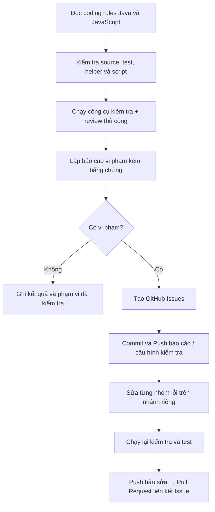

# Hướng dẫn kiểm tra coding rules Java/JavaScript và tạo GitHub Issue

Cần tách thành **hai việc**: kiểm tra coding rules và tạo GitHub Issue cho các vi phạm. **Issue được tạo trực tiếp trên GitHub; thao tác Push dùng để đưa commit chứa code, cấu hình hoặc báo cáo lên GitHub.**

Tài liệu này hướng dẫn quy trình; không phải kết quả audit và không xác nhận đã tạo Issue, sửa source hay push commit.

## Luồng thực hiện



## 1. Chốt tài liệu dùng để kiểm tra

Dùng cả ba file:

- [docs_requirement/java-coding-rules.md](../docs_requirement/java-coding-rules.md): quy tắc Java.
- [docs_requirement/javascript-coding-rules.md](../docs_requirement/javascript-coding-rules.md): quy tắc JavaScript.
- [docs/coding-rules.md](coding-rules.md): phạm vi áp dụng và điều chỉnh riêng của dự án.

Ví dụ, package `vn.tungxeng.hr` đã được quy định cho dự án nên không được báo lỗi chỉ vì khác package mẫu trong Java convention.

## 2. Kiểm tra tự động kết hợp review thủ công

| Phần kiểm tra | Cách thực hiện |
|---|---|
| Java: naming, formatting, cấu trúc, Javadoc bắt buộc | Cấu hình công cụ như Checkstyle theo các quy tắc đã chốt |
| JavaScript: naming, cấu trúc, lỗi thường gặp, JSDoc | Cấu hình ESLint và bộ quy tắc JSDoc phù hợp |
| Nội dung Javadoc/JSDoc có đúng không | Review thủ công hoặc dùng AI hỗ trợ, đối chiếu source |
| Comment có giải thích logic khó hiểu không | Review thủ công |
| Thay đổi có làm hỏng chức năng không | Chạy lại Unit/Integration/E2E test phù hợp |

**Không nên bật toàn bộ cấu hình mặc định của công cụ rồi coi mọi cảnh báo là vi phạm tài liệu.** Mỗi lỗi phải đối chiếu được với rule áp dụng.

Trong lần kiểm tra repository trước khi soạn hướng dẫn này, dự án chưa có cấu hình đầy đủ cho các kiểm tra này. Cần kiểm tra lại trạng thái cấu hình khi thực hiện audit; thiết lập các kiểm tra còn thiếu trước khi kỳ vọng CI tự phát hiện vi phạm.

## 3. Lập báo cáo trước khi tạo Issue

Có thể lưu tại đường dẫn tính từ thư mục gốc repository:

```text
docs/code-review/coding-rule-report_YYYYMMDD_HHmmss.md
```

Mỗi phát hiện cần có:

| Nội dung | Ví dụ |
|---|---|
| Mã phát hiện | `CR-JAVA-001` |
| Rule bị vi phạm | Mục Documentation Comments |
| Vị trí | File, class/method và dòng |
| Hiện trạng | Public method chưa mô tả hợp đồng sử dụng |
| Kỳ vọng | Có Javadoc mô tả tham số, kết quả và lỗi liên quan |
| Cách khắc phục | Bổ sung documentation phù hợp với hành vi thực tế |
| Bằng chứng | Trích đoạn source hoặc kết quả công cụ |
| Trạng thái | Đã xác nhận / cần làm rõ / ngoại lệ hợp lệ |

Không đánh dấu toàn bộ source “đạt” khi chỉ kiểm tra một số file.

## 4. Tạo Issue trên giao diện GitHub

Trong repository, vào **Issues → New issue**, rồi nhập tiêu đề và nội dung.

Nên nhóm các lỗi cùng nguyên nhân, chẳng hạn:

- `[Coding rules][Java] Bổ sung Javadoc cho các hợp đồng service`
- `[Coding rules][JavaScript] Bổ sung JSDoc cho các hàm xử lý CSV`
- `[Quality gate] Thiết lập kiểm tra coding rules trong CI`

Mẫu nội dung Issue:

```markdown
## Quy tắc áp dụng
Đường dẫn tài liệu và mục quy định cụ thể.

## Hiện trạng và bằng chứng
Danh sách file, method/function, dòng và lỗi đã xác nhận.

## Kết quả mong muốn
Mô tả yêu cầu cần đáp ứng.

## Phạm vi sửa
Các file hoặc nhóm chức năng liên quan.

## Tiêu chí hoàn thành
- [ ] Đã sửa các vi phạm được liệt kê.
- [ ] Javadoc/JSDoc phản ánh đúng hành vi.
- [ ] Kiểm tra coding rules đạt trong phạm vi sửa.
- [ ] Các test liên quan đạt.
- [ ] Đã cập nhật báo cáo và liên kết PR.
```

Kiểm tra Issue hiện có trước để tránh tạo trùng. Thiếu Javadoc thường là vấn đề bảo trì/chất lượng; không nên tự động gán mức Critical.

## 5. Commit và Push trên VS Code

Sau khi có báo cáo hoặc cấu hình kiểm tra:

1. Giữ nhánh làm việc, ví dụ `main_thanhtung`.
2. Mở **Source Control**, xem nội dung thay đổi.
3. **Stage Changes** các file báo cáo/cấu hình cần đưa lên.
4. Nhập mô tả commit, ví dụ: `Add coding-rule audit report`.
5. Chọn **Commit**, sau đó **Push**.
6. Gắn liên kết báo cáo đã push vào Issue.

Nếu chỉ kiểm tra thì chưa cần sửa source. Bản sửa nên được thực hiện sau trên nhánh phù hợp, rồi mở PR liên kết Issue.

## 6. Mẫu yêu cầu giao AI thực hiện

> Kiểm tra toàn bộ Java/JavaScript do dự án quản lý theo hai coding rules và các điều chỉnh trong docs/coding-rules.md. Chưa sửa source. Lập báo cáo từng vi phạm có dẫn chiếu rule, file, dòng và bằng chứng; phân biệt lỗi đã xác nhận với điểm cần làm rõ. Đề xuất nhóm GitHub Issues, kiểm tra trùng trước khi tạo. Sau khi thống nhất repository, nhánh và phạm vi commit, tạo Issues và push báo cáo.

## 7. Thông tin cần chốt trước khi ghi lên GitHub

- **Tạo Issue ở repository nào?** Xác định đúng chủ sở hữu và tên repository.
- **Push báo cáo vào nhánh nào?** Ví dụ `main_thanhtung`, nếu đó là nhánh đã thống nhất.
- **Phạm vi commit gồm những file nào?** Chỉ báo cáo hay cả cấu hình kiểm tra.
- **Có sửa source trong cùng đợt hay chỉ kiểm tra?** Tách rõ audit và sửa lỗi.

Việc tạo tài liệu hướng dẫn này không đồng nghĩa đã có yêu cầu thực hiện audit, tạo Issue hoặc push lên GitHub.
